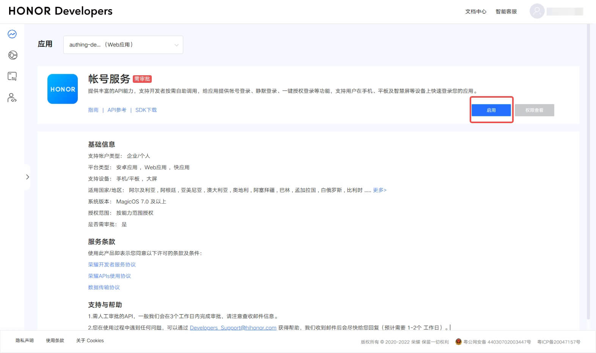
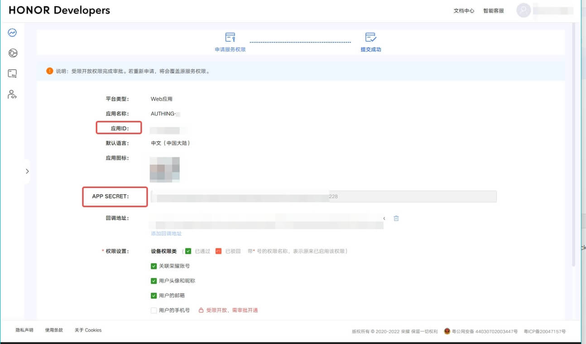
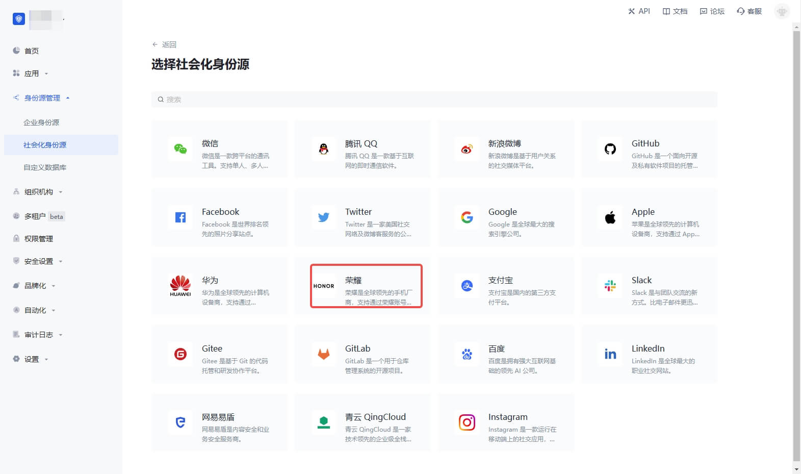
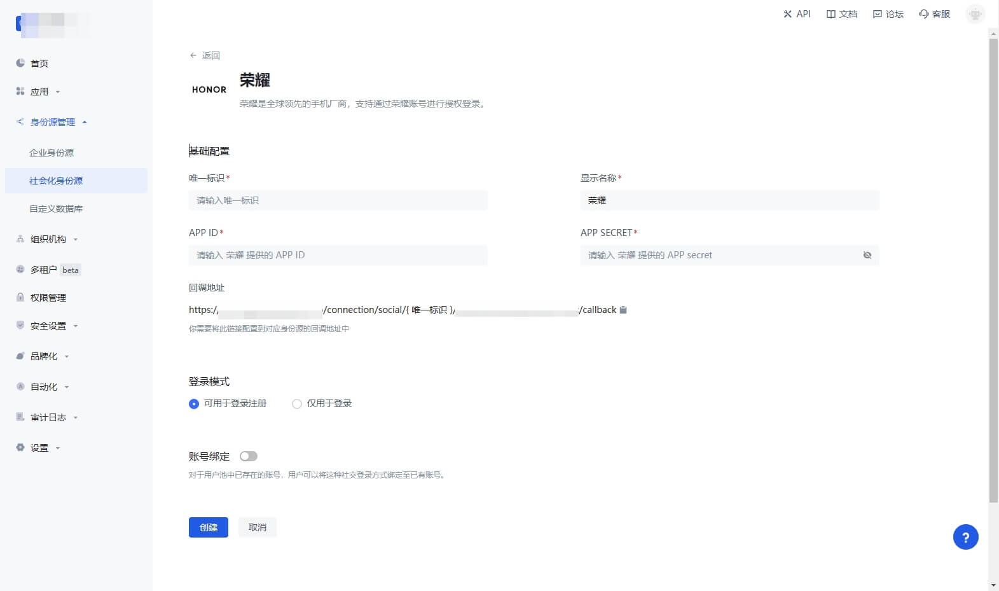

# 荣耀 

<LastUpdated />

## 场景介绍

- **概述**：荣耀 社会化登录是用户以 荣耀 为身份源安全登录第三方应用或者网站。在 {{$localeConfig.brandName}} 中配置并开启 荣耀 的社会化登录，即可实现通过 {{$localeConfig.brandName}} 快速获取 荣耀 基本开放的信息和帮助用户实现免密登录功能。
- **应用场景**：PC 网站
- **终端用户预览图**：

## 注意事项

- 如果你还没有 荣耀 账号，请先前往 [荣耀开发者服务平台](https://developer.hihonor.com/)上注册成为开发者并完成实名认证，具体方法请参见 [荣耀开发者帐号注册认证](https://developer.hihonor.com/cn/doc/guides/100272)。
- 如果你未开通 {{$localeConfig.brandName}} 控制台账号，请先前往 [{{$localeConfig.brandName}} 控制台](https://authing.cn/) 注册开发者账号

## 第一步：在 荣耀 创建一个服务器应用

登录[荣耀开发者服务平台](https://developer.hihonor.com/)，点击 “管理中心”：

在“管理中心”页面，点击“帐号服务”:

在“帐号服务”页面，依次点击操作 请选择应用 → Web应用 → 新建应用:

选择平台类型为Web → 填入应用名称 → 选择默认语言 → 上传应用图标 → 创建

回到 “账号服务页面” 点击 “启用“

配置**应用的回调地址**
- 应用回调地址：填写`https://core.authing.cn/connection/social/{唯一标识}/{用户池ID}/callback`，你需要将其中的 `{唯一标识}` 替换为你正在 {{$localeConfig.brandName}} 创建的身份源所填写的`唯一标识`，`{用户池ID}` 替换成你的 [用户池 ID](/guides/faqs/get-userpool-id-and-secret.md)

最后点击「**提交**」，创建完成之后，你需要记录下 `应用 ID` 和 `APP SECRET`，下一步需要用到。

## 第二步：在 {{$localeConfig.brandName}} 控制台配置 荣耀 应用配置

2.1 请在 {{$localeConfig.brandName}} 控制台的「社会化身份源」页面，点击「创建社会化身份源」按钮，进入「选择社会化身份源」页面。

2.2 在「选择社会化身份源」页面，点击「荣耀」卡片。

2.3 在「荣耀」配置页面，填写相关的字段信息。

| 字段          | 描述|
| ------------- | ------------------ |
| 唯一标识      | a. 唯一标识由小写字母、数字、- 组成，且长度小于 32 位。 b. 这是此连接的唯一标识，设置之后不能修改。|
| 显示名称      | 这个名称会显示在终端用户的登录界面的按钮上。  |
| APP ID     | 上一步获取的 荣耀 应用 ID。 |
| APP Secret | 上一步获取的 荣耀 应用 Secret。 |
| 登录模式      | 开启「仅登录模式」后，只能登录既有账号，不能创建新账号，请谨慎选择。 |
| 账号身份关联  | 不开启「账号身份关联」时，用户通过身份源登录时默认创建新用户。开启「账号身份关联」后，可以允许用户通过「字段匹配」或「询问绑定」的方式直接登录到已有的账号。 |

2.4 配置完成后，点击「创建」或者「保存」按钮完成创建。

## 第三步：开发接入

- **推荐开发接入方式**：使用托管登录页
- **优劣势描述**：运维简单，由 {{$localeConfig.brandName}} 负责运维。每个用户池有一个独立的二级域名；如果需要嵌入到你的应用，需要使用弹窗模式登录，即：点击登录按钮后，会弹出一个窗口，内容是 {{$localeConfig.brandName}} 托管的登录页面，或者将浏览器重定向到 {{$localeConfig.brandName}} 托管的登录页。
- **详细接入方法**：

  3.1 在 {{$localeConfig.brandName}} 控制台创建一个应用，详情查看：[如何在 {{$localeConfig.brandName}} 创建一个应用](/guides/app-new/create-app/create-app.md)

  3.2 在已创建好的「荣耀」身份源连接详情页面，开启并关联一个在 {{$localeConfig.brandName}} 控制台创建的应用

  3.3 点击 {{$localeConfig.brandName}} 控制台的应用「体验登录」按钮，在弹出的登录窗口体验「荣耀」登录

  
