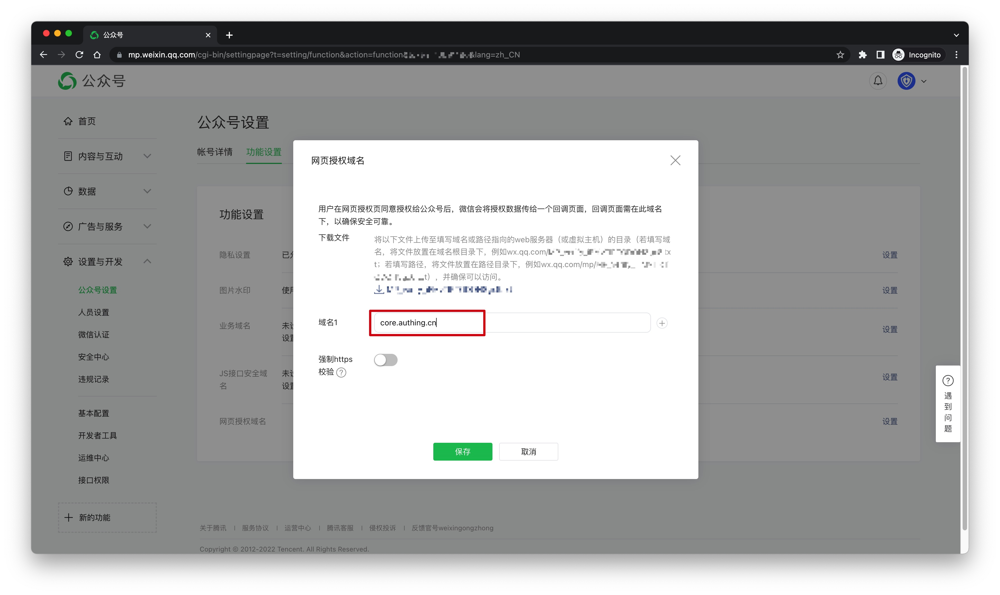
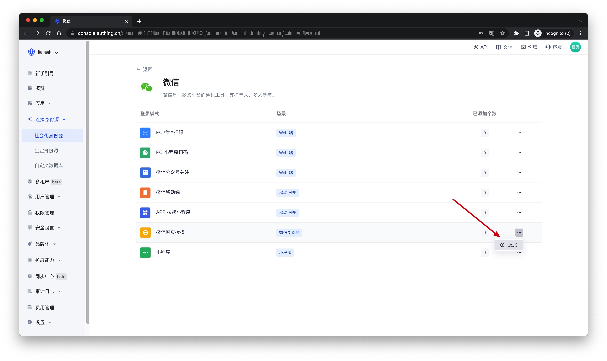

# 微信网页授权

<LastUpdated />

## 场景介绍

- **概述**：{{$localeConfig.brandName}} 通过 SDK 为开发者提供了一种快速在微信网页中获取用户信息并完成登录的方法。如果用户在微信客户端中访问第三方网页、公众号可以通过微信网页授权机制，来获取用户基本信息，进而实现业务逻辑。
- **应用场景**：微信浏览器
- **终端用户预览图**：


## 注意事项

- 如果你未开通 {{$localeConfig.brandName}} 控制台账号，请先前往 [{{$localeConfig.brandName}} 控制台](https://authing.cn/) 注册开发者账号；

## 第一步：在微信公众平台创建一个微信服务号

前往 [微信公众平台](https://mp.weixin.qq.com/cgi-bin/readtemplate?t=register/step1_tmpl&lang=zh_CN)创建一个 **微信服务号**。


创建完成之后，你需要记录下该应用的 `AppID` 和 `AppSecret`，后面需要用到。


之后需在微信公众平台后台的 **设置与开发 -> 公众号设置 -> 功能设置** 页面中，设置 **网页授权域名** 为`core.authing.cn`。
出于安全验证考虑，微信服务器需要和 Authing 服务器做一次请求验证，开发者需要下载 txt 文件，并记录 **文件名** 和 **文本内容**。


## 第二步：在 {{$localeConfig.brandName}} 控制台配置微信网页授权应用

2.1 请在 {{$localeConfig.brandName}} 控制台的「社会化身份源」页面，点击「创建社会化身份源」按钮，进入「选择社会化身份源」页面。


2.2 在「选择社会化身份源」页面，点击「微信」卡片，进入「微信登录模式」页面。


2.3 继续点击「微信网页授权」登录模式，或者点击 **… 添加** 打开「微信网页授权」配置页面。


2.4 在「微信网页授权」配置页面，填写相关的字段信息。


| 字段             | 描述  |
| ---------------- | ------------------------------------------------ |
| 唯一标识         | a. 唯一标识由小写字母、数字、- 组成，且长度小于 32 位。<br />b. 这是此连接的唯一标识，设置之后不能修改。                                                                                                                                                                                                                                                   |
| 显示名称         | 这个名称会显示在终端用户的登录界面的按钮上。                                                                                                                                                                                                                                                                                                               |
| 开发者 ID        | 步骤 1 中获得的 AppID。                                                                                                                                                                                                                                                                                                                                    |
| 开发者密码       | 步骤 1 中获得的 AppSecret                                                                                                                                                                                                                                                                                                                                  |
| 域名校验文件名   | 步骤 1 中获得的域名校验文件名，例如：MP_verify_t1op33AC5w4rNIwE.txt                                                                                                                                                                                                                                                                                        |
| 域名校验文件内容 | 步骤 1 中获得的的域名校验文件内容，例如：E1op22BD7w1rMItt                                                                                                                                                                                                                                                                                                  |
| Callback URL     | 你的业务回调链接                                                                                                                                                                                                                                                                                                                                           |
| Scopes           | 应用授权作用域，snsapi_base （不弹出授权页面，直接跳转，只能获取用户 openid），snsapi_userinfo （弹出授权页面，可通过 openid 拿到昵称、性别、所在地。并且， 即使在未关注的情况下，只要用户授权，也能获取其信息 ）。详情请见 [微信公众号网页授权文档说明](https://developers.weixin.qq.com/doc/offiaccount/OA_Web_Apps/Wechat_webpage_authorization.html)。 |
| 登录模式         | 开启「仅登录模式」后，只能登录既有账号，不能创建新账号，请谨慎选择。                                                                                                                                                                                                                                                                                       |
| 账号身份关联     | 不开启「账号身份关联」时，用户通过身份源登录时默认创建新用户。开启「账号身份关联」后，可以允许用户通过「字段匹配」或「询问绑定」的方式直接登录到已有的账号。                                                                                                                                                                                               |

2.5 配置完成后，点击「创建」或者「保存」按钮完成创建。

## 第三步：开发接入

> 你可以在此获取示例代码：[https://github.com/authing/wechat-eco-solution](https://github.com/authing/wechat-eco-solution)，访问线上[示例应用](https://www.authing.cn/sample-wx.html)。

### 使用 SDK 接入

首先使用 CDN 引入 `authing-wxmp-sdk`

```html
<script src="https://cdn.authing.co/packages/authing-wxmp-sdk/<latest-version>/authing-wxmp-sdk.min.js"></script>
```

:::hint-info

请将`<latest-version>`替换成当前最新版本，最新版本可以在 [https://www.npmjs.com/package/@authing/wxmp](https://www.npmjs.com/package/@authing/wxmp)查看。

authing-wxmp-sdk 的详细文档请见：[微信网页授权登录 SDK](/reference/sdk-for-wxmp.md)。

:::

#### 初始化 SDK

使用用户池 ID 初始化 SDK：

```javascript
const authingWx = new AuthingWxmp({
  userPoolId: "YOUR_USERPOOLID"
});
```

#### 发起微信授权

调用 `getAuthorizationUrl` 方法获取微信授权登录链接，修改 `window.location` 跳转到微信登录授权页面：

```javascript
window.location = authingWx.getAuthorizationUrl();
```

#### 获取用户信息

跳回业务回调链接之后通过 `getUserInfo` 方法获取用户信息：

```javascript
// 若在回调页面 authingWx 未初始化，需要先初始化，具体初始化方式参考上文
const { ok, userinfo, message } = authingWx.getUserInfo();
if (ok) {
  console.log(userinfo);
} else if (message) {
  // message 中包含了错误提示
  alert(message);
}
```

### 使用内嵌登录组件接入

以 `React` 为例。

#### 安装 `@authing/react-ui-components`

```bash

$ yarn add @authing/react-ui-components

# OR

$ npm install @authing/react-ui-components --save

```

#### 初始化

```js
import React from "react";
import ReactDOM from "react-dom";
import { AuthingGuard } from "@authing/react-ui-components";
// 引入 css 文件
import "@authing/react-ui-components/lib/index.min.css";

const App = () => {
  const appId = "AUTHING_APP_ID";
  const onLogin = userInfo => {
    console.log(userInfo);
  };
  return <AuthingGuard appId={appId} onLogin={onLogin} />;
};

ReactDOM.render(<App />, root);
```

#### 使用

初始化完成后在微信中打开页面会见到如下按钮，点击即可进行授权，授权完成后会跳转到应用回调链接，且可使用 [AuthenticationClient](/reference/sdk-for-node/authentication/AuthenticationClient.md) 获取用户信息。


