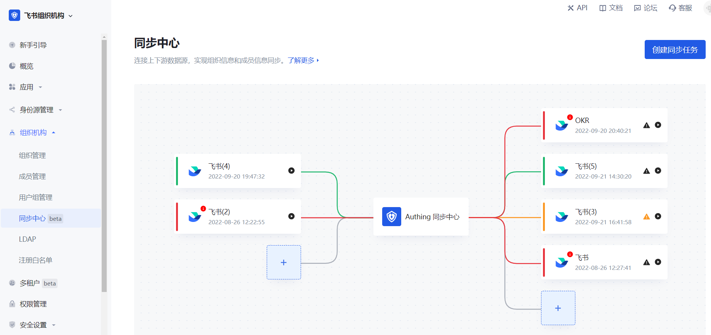
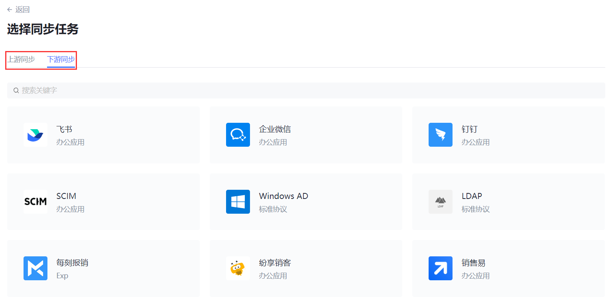

# 创建同步任务

<LastUpdated/>

路径：**组织机构->同步中心**

在 [控制台](https://console.authing.cn/) 点击左侧导航栏 **用户管理->同步中心**（对于 ToE 的场景，路径是 **组织机构->同步中心**）即可进入同步中心管理页面 ，在这里你可以看到所有已创建的同步任务，也可以创建新的同步任务。

要创建新的同步任务，执行以下步骤：

1. 在 **同步中心** 页面点击 **创建同步任务** 按钮，或者直接在画板点击加号按钮打开 **选择同步任务** 窗口（对于后者，略过步骤 2 直接执行步骤 3）。 

::: hint-info
* 点击 **Authing 同步中心** 左侧加号为创建上游同步任务。
* 点击 **Authing 同步中心** 右侧加号为创建下游同步任务。
:::

2. 在 **选择同步任务** 窗口根据需要切换 **上游同步** / **下游同步** 选项卡，选择进入一个上 / 下游应用。 打开该应用的同步任务创建窗口。

::: hint-info
在一个用户池新建一个同步任务时，同一个数据源不能既作为上游，又同时充当下游。
:::

3. 根据提示填写配置信息。 有关获取配置信息详情，请参阅 [获取应用配置项和权限](/guides/sync-new/create-sync-new/get-config-new/feishu.md)。

4. 筛选同步范围。有关筛选同步范围详情，请参阅 [筛选同步范围](/guides/sync-new/create-sync-new/sync-scope-new.md)。

::: hint-info
本步骤仅适用于下游同步。
:::

5. 配置用户同步字段映射。 有关同步字段映射的配置详情，请参阅 [配置用户同步字段映射](/guides/sync-new/create-sync-new/field-mapping-new.md)。

6. 选择适用的同步时机（提供 **手动**、**定时同步**、**实时同步** 三种同步方式)。 有关同步时机详情，请参阅 [配置同步时机](/guides/sync-new/create-sync-new/sync-type-new.md)。

7. 配置同步策略。 有关同步策略详情，请参阅 [配置同步策略](/guides/sync-new/create-sync-new/sync-policy-new.md)。

::: hint-info
本步骤仅适用于上游同步。
:::

8. 点击 **创建**。

9. 重新进入所选应用的配置详情页，拷贝 **事件订阅请求网址 URL**。

::: hint-info
本步骤仅适用于上游同步。
对于上游同步，{{$localeConfig.brandName}} 会在 **配置信息** 模块自动生成一个回调地址，用于接收应用事件。
:::

10. 配置应用权限。 有关配置应用权限，请参阅 [获取应用配置项和权限](/guides/sync-new/create-sync-new/get-config-new/feishu.md)。

同步任务创建完成。
