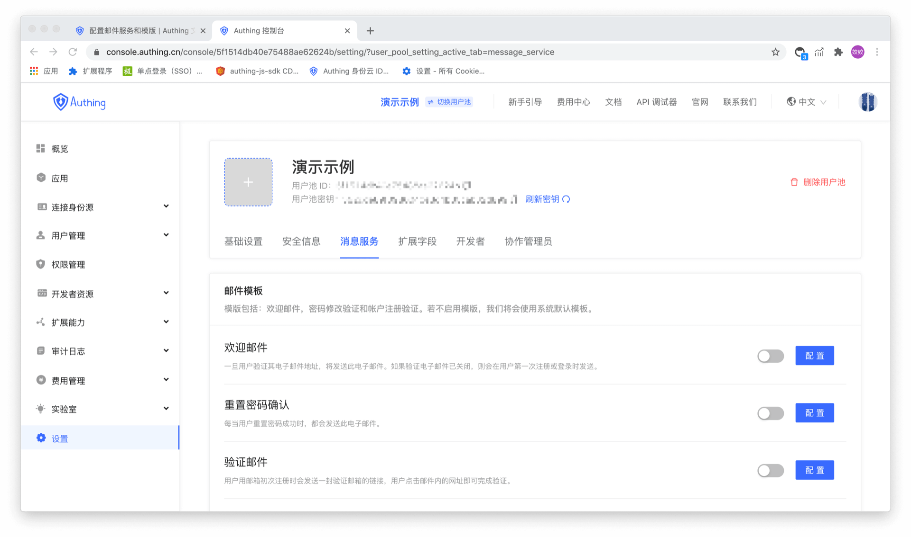

# 配置邮件服务和模版

<LastUpdated/>

::: hint-info
有关支持「消息设置」功能各项权益的 {{$localeConfig.brandName}} 用户池版本信息，请查看 [官网「价格」页](https://authing.cn/pricing)。如你的版本不支持此权益，且想试用，可开通体验期。有关体验期介绍及开通方式，请查看 [体验期](/guides/basics/trial/README.md)。
::: 

邮件是 Authing 提供的针对使用「邮箱」注册的用户的邮件发送服务，进入任意应用后按照下图点击按钮即可进入邮件管理面板：



## 管理邮件模版

在邮件模版中可以配置六种类型的邮件模版，分别是：

1. **欢迎邮件** - 若用户使用邮箱注册会发送此邮件。
2. **重置密码确认** - 每当用户重置密码成功时，都会发送此电子邮件。
3. **验证邮件** - 用户使用邮箱注册会发送一封验证邮件给用户用来验证邮箱，用户点击邮箱中的链接即可完成验证。
4. **修改绑定邮箱** - 每当用户需要修改绑定邮箱、发送验证码时，都会发送此电子邮件。
5. **重置密码** - 每当用户忘记密码时系统将发送此重置密码的邮件，邮件中附带一个验证码，用户提交验证码和新密码后将可以重置密码。
6. **修改密码** - 每当用户要求更改密码时，都会发送此电子邮件，邮件中附带一个验证码，用户需要填写此验证码完成密码修改。

如下图所示：


### 邮件宏命令

宏命令用来生成一些动态内容，比如：

```html
<div style="padding: 35px;">
	<table cellpadding="0" align="center" style="width: 600px; margin: 0px auto; text-align: left; position: relative; border-top-left-radius: 5px; border-top-right-radius: 5px; border-bottom-right-radius: 5px; border-bottom-left-radius: 5px; font-size: 14px; font-family:微软雅黑, 黑体; line-height: 1.5; box-shadow: rgb(153, 153, 153) 0px 0px 5px; border-collapse: collapse; background-position: initial initial; background-repeat: initial initial;background:#fff;">
		<tbody>
			<tr>
				<th valign="middle" style="height: 25px; line-height: 25px; padding: 15px 35px; border-bottom-color: rgba(18, 24, 37, 0.87); background-color: #484f60; border-bottom-color: #C46200; background-color: #484f60; border-top-left-radius: 5px; border-top-right-radius: 5px; border-bottom-right-radius: 0px; border-bottom-left-radius: 0px;">
					<font face="微软雅黑" size="5" style="color: rgb(255, 255, 255); ">{{AUTHING_CLIENT_NAME}} </font>
				</th>
			</tr>
			<tr>
				<td>
					<div style="padding:25px 35px 40px; background-color:#fff;">
						<h2 style="margin: 5px 0px; "><font color="#333333" style="line-height: 20px; "><font style="line-height: 22px; " size="4">你好，{{AUTHING_USER_EMAIL}}</font></font></h2>
						<p>欢迎加入 {{AUTHING_CLIENT_NAME}}</p>
						<p>
							{{AUTHING_CLIENT_DESCRIPTION}}
						</p>
						<p align="right">{{AUTHING_CLIENT_NAME}} 团队</p>
						<p align="right">{{TIME}}</p>
					</div>
				</td>
			</tr>
		</tbody>
	</table>
</div>
```

这篇邮件中的 <span v-pre>{{AUTHING_CLIENT_NAME}}</span>、<span v-pre>{{AUTHING_CLIENT_DESCRIPTION}}</span>、<span v-pre>{{TIME}}</span>、<span v-pre>{{AUTHING_USER_EMAIL}}</span> 都属于宏命令，这篇邮件在 Authing 经过解析后的结果会类似于下面这样：


目前支持的所有宏命令如下表所示：

| 宏命令                                            | 作用                                        |
| :------------------------------------------------ | :------------------------------------------ |
| <span v-pre>{{AUTHING_CLIENT_NAME}}</span>        | 创建的 Authing 应用名称                     |
| <span v-pre>{{TIME}}</span>                       | 当前时间                                    |
| <span v-pre>{{AUTHING_USER_EMAIL}}</span>         | 当前注册用户的邮箱                          |
| <span v-pre>{{AUTHING_CLIENT_DESCRIPTION}}</span> | 创建的 Authing 应用描述                     |
| <span v-pre>{{AUTHING_VERIFY_LINK}}</span>        | 验证邮箱邮件中的验证链接（由 Authing 生成） |
| <span v-pre>{{AUTHING_VERIFY_CODE}}</span>        | 重置密码前发送的验证码                      |

## 配置第三方邮件服务

我们自带的邮件发送服务器使用阿里云企业邮箱，若你想自定义邮件服务器可在此页面中设置：

<StackSelector snippet="config-email-provider" selectLabel="选择邮件服务商" :order="['mxhichina', 'exmail', 'sendgrid', 'smtp']"/>
