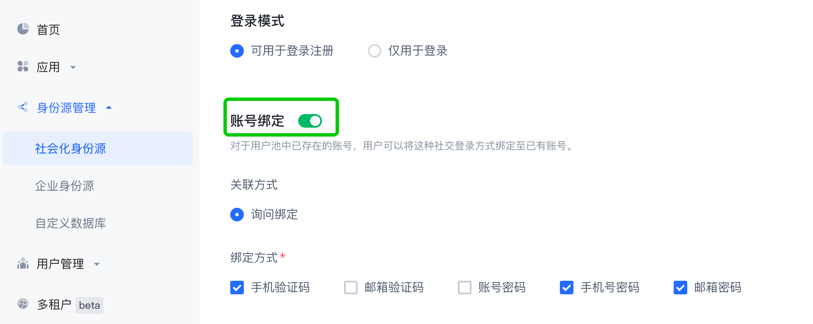

# 微信登录

<LastUpdated/>

## 准备工作

在 [微信开放平台](https://open.weixin.qq.com/cgi-bin/index?t=home/index&lang=zh_CN) 及 [Authing 管理控制台](https://www.authing.cn/) 进行配置请参阅 [微信移动端](https://docs.authing.cn/v2/guides/connections/social/wechat-mobile/)。


<br>

## 集成微信登录

### 第一步：添加微信登录依赖

1. 在 swift package 搜索栏输入：https://github.com/Authing/authing-binary 。

2. 选择 [Authing-binary](https://github.com/Authing/authing-binary)。
> [Authing-binary](https://github.com/Authing/authing-binary) 依赖于 [Guard-iOS SDK](https://github.com/Authing/guard-ios)。

3. 依赖规则选择 **Up to Next Major Version 1.0.0** 。

4. Add Package 后勾选 **Wechat** 。

<br>

### 第二步：Info.plist 里面添加启动微信白名单

key: LSApplicationQueriesSchemes

value: weixin, weixinULAPI

> 注意大小写


也可以通过 Source Code 方式打开 Info.plist，然后复制粘贴下面代码：

```xml
<plist version="1.0">
<dict>
    ...
    <key>LSApplicationQueriesSchemes</key>
	<array>
		<string>weixin</string>
		<string>weixinULAPI</string>
	</array>
    ...
</dict>
</plist>
```

<br>

### 第三步：初始化微信登录

```swift
import Guard
import Wechat
Authing.start(<#AUTHING_APP_ID#>)
WechatLogin.registerApp(appId: <#your_wechat_appid#>, universalLink: <#your_deep_link#>)
 ```

> 第一个参数为微信应用 ID；第二个参数为 iOS [Universal Link](https://developer.apple.com/ios/universal-links/)

<br>

### 第四步：设置 Associated Domains：

> 填入开发者的 Universal Link 对应的 host 。


<br>

### 第五步：处理微信登录回调

微信返回应用后，如果使用了 SceneDelegate，则需要在 SceneDelegate.swift 里面重载下面的函数：

```swift
func scene(_ scene: UIScene, continue userActivity: NSUserActivity) {
    NotificationCenter.default.post(name: NSNotification.Name(rawValue: "wechatLoginOK"), object: userActivity)
}
```

如果未使用 SceneDelegate，则需要在 AppDelegate 里面重载：

```swift
func application(_ application: UIApplication, continue userActivity: NSUserActivity, restorationHandler: @escaping ([UIUserActivityRestoring]?) -> Void) -> Bool {
    NotificationCenter.default.post(name: NSNotification.Name(rawValue: "wechatLoginOK"), object: userActivity)
    return true
}
```

<br>

### 第六步：发起微信登录授权

#### 微信授权登录

```swift
func login(viewController: UIViewController, _ context: String? = nil, completion: @escaping Authing.AuthCompletion) -> Void
```

**参数**

* *viewController* 承载视图的 AuthViewController
* *context* 可选参数，请求上下文，这里设置的 `context` 可以在 [pipeline 的 context](/guides/pipeline/context-object.md) 中获取到。

**示例**

```swift
WechatLogin.login(viewController: <#ViewController#>) { code, message, userInfo in
    if (code == 200) {
        // 登录成功
        // userInfo
    } else if (code == 1640) {
        // 只允许绑定已有账号
        // userInfo.socialBindingData 中返回 method(登录方式) 以及 key(中间态键)
    } else if (code == 1641) {
        // 允许绑定已有账号，或者创建新账号
        // userInfo.socialBindingData 中返回 method(登录方式) 以及 key(中间态键)
    } else if (code == 2921) {
        // 多账号选择后绑定
        // userInfo.socialBindingData 中返回 accounts(账号列表) 以及 key(中间态键)
    }
}
```

<br>

如果只需获取微信的授权码：

```swift
WechatLogin.getAuthCode(viewController: <#ViewController#>) { authCode in
    // authCode：微信授权码
}
```

<br>

如果开发者自己集成微信登录，拿到授权码后，可以调用以下 API 换取 Authing 用户信息：

#### 通过微信授权码登录

```swift
func getDataByWechatlogin(authData: AuthRequest? = nil, code: String, _ context: String? = nil, completion: @escaping(Int, String?, UserInfo?) -> Void)
```

**参数**

* *code* 微信授权码
* *context* 请求上下文，这里设置的 `context` 可以在 [pipeline 的 context](/guides/pipeline/context-object.md) 中获取到。

**示例**

```swift
AuthClient().getDataByWechatlogin(code: "Wechat auth code") { code, message, userInfo in
    if (code == 200) {
        // 登录成功
        // userInfo
    } else if (code == 1640) {
        // 只允许绑定已有账号
        // userInfo.socialBindingData 中返回 method(登录方式) 以及 key(中间态键)
    } else if (code == 1641) {
        // 允许绑定已有账号，或者创建新账号
        // userInfo.socialBindingData 中返回 method(登录方式) 以及 key(中间态键)
    } else if (code == 2921) {
        // 多账号选择后绑定
        // userInfo.socialBindingData 中返回 accounts(账号列表) 以及 key(中间态键)
    }
}
```

## 询问绑定 API

如果你想在微信账号登录的时候绑定实现询问是否绑定已有账号，可以在  [Authing Console 控制台](https://authing.cn/)中开启询问绑定功能，

**身份源管理 -> 社会化身份源 -> 微信 -> 微信移动端** **-> 账号绑定：**



:::hint-info
如果使用我们的 **AuthFlow** 托管页，开启了**账号绑定**后，托管页中处理了相关业务流程。
:::

如果已经选择了**登录模式**，并且开启了**账号绑定**功能，通过如下 API 构建后续业务流程：

### 注册新账号绑定微信

如果**登录模式**选择了可用于**登录注册**，并且开启了**账号绑定**，在调用微信登录接口时会返回 `1641` 状态码以及 `key`，这个时候可以调用此接口直接创建账号。


```swift
func bindWechatWithRegister(key: String, completion: @escaping(Int, String?, UserInfo?) -> Void)
``` 

**参数**

* *key* 中间态键，通过[微信授权登录](#-微信授权登录)返回

**示例**

```swift
AuthClient().bindWechatWithRegister(key: "key") { code, message, userInfo in
}
```

<br>

### 通过账号密码绑定微信

如果开启了**账号绑定**，在调用微信登录接口时会返回 `1640` 状态码、支持的绑定方式以及 `key`，如果支持的绑定方式包含`username-password`、`phone-password`、`email-password`，这个时候可以调用此接口绑定已有账号。

```swift
func bindWechatByAccount(account: String, password: String, key: String, completion: @escaping(Int, String?, UserInfo?) -> Void)
``` 

**参数**

* *account* 账号
* *password* 密码
* *key* 中间态键，通过[微信授权登录](#-微信授权登录)返回

**示例**

```swift
AuthClient().bindWechatByAccount(account: "account", password: "password", key: "key") { code, message, userInfo in
}
```

<br>

### 通过手机验证码绑定微信

如果开启了**账号绑定**，在调用微信登录接口时会返回 `1640` 状态码、支持的绑定方式以及 `key`，如果支持的绑定方式包含`phone-code`，这个时候可以调用此接口绑定已有账号。

```swift
func bindWechatByPhoneCode(phoneCountryCode: String? = nil, phone: String, code: String, key: String, completion: @escaping(Int, String?, UserInfo?) -> Void)
``` 

**参数**

* *phone* 手机号
* *code* 验证码
* *key* 中间态键，通过[微信授权登录](#-微信授权登录)返回

**示例**

```swift
AuthClient().bindWechatByPhoneCode(phone: "188xxxx8888", code: "1234", key: "key") { code, message, userInfo in
}
```

<br>

### 通过邮箱验证码绑定微信

如果开启了**账号绑定**，在调用微信登录接口时会返回 `1640` 状态码、支持的绑定方式以及 `key`，如果支持的绑定方式包含`email-code`，这个时候可以调用此接口绑定已有账号。

```swift
func bindWechatByEmailCode(email: String, code: String, key: String, completion: @escaping(Int, String?, UserInfo?) -> Void)
``` 

**参数**

* *email* 邮箱
* *code* 验证码
* *key* 中间态键，通过[微信授权登录](#-微信授权登录)返回

**示例**

```swift
AuthClient().bindWechatByEmailCode(email: "test@example.com", code: "1234", key: "key") { code, message, userInfo in
}
```

<br>

### 通过 accounts 列表的账号 ID 绑定微信

如果开启了**账号绑定**，在调用微信登录接口时会返回 `2921` 状态码、支持的绑定的账号数据以及 `key`。
> 注意此 API 只能绑定[ getDataByWechatlogin ](#-通过微信授权码登录)返回的 accounts 中的账号，只针对同一微信身份源对应了多个 Authing 账号的场景。如果想直接调用绑定 API 无特殊场景处理，查看此 API ：[通过账号 ID 绑定微信](#-通过账号-ID-绑定微信)。
  
```swift
func bindWechatBySelectedAccountId(accountId: String, key: String, completion: @escaping(Int, String?, UserInfo?) -> Void)
``` 

**参数**

* *accountId* 账号 id
* *key* 中间态键，通过[微信授权登录](#-微信授权登录)返回

**示例**

```swift
AuthClient().bindWechatBySelectedAccountId(accountId: "AUTHING_ACCOUNT_ID", key: "key") { code, message, userInfo in
}
```

<br>


### 通过账号 ID 绑定微信

如果开启了**账号绑定**，调用此接口可绑定用户池中已有账号。

```swift
func bindWechatByAccountId(accountId: String, key: String, completion: @escaping(Int, String?, UserInfo?) -> Void)
``` 

**参数**

* *accountId* 账号 id
* *key* 中间态键，通过[微信授权登录](#-微信授权登录)返回

**示例**

```swift
AuthClient().bindWechatByAccountId(accountId: "AUTHING_ACCOUNT_ID", key: "key") { code, message, userInfo in
}
```

<br>

