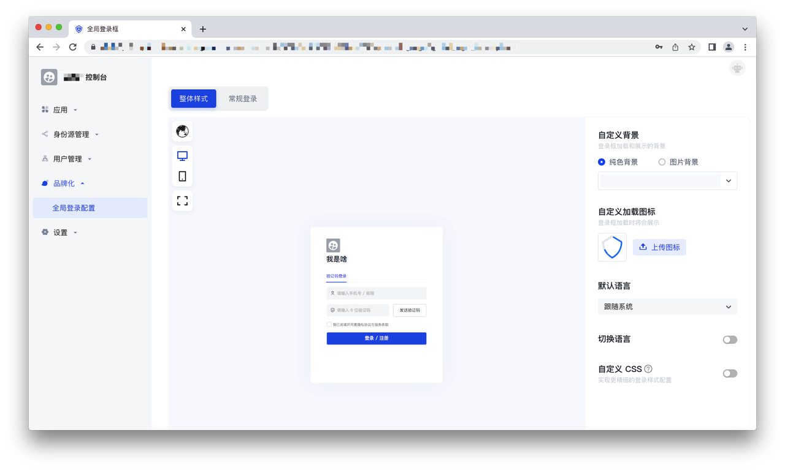
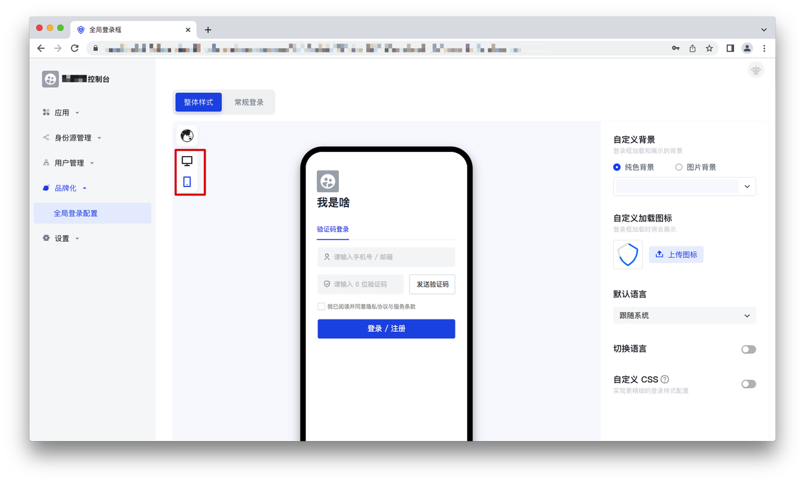
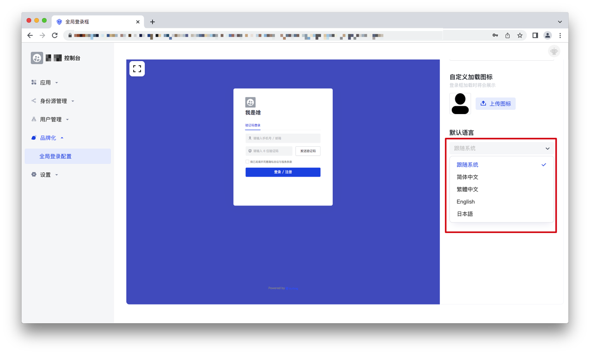
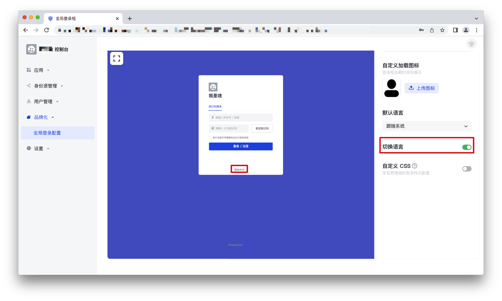
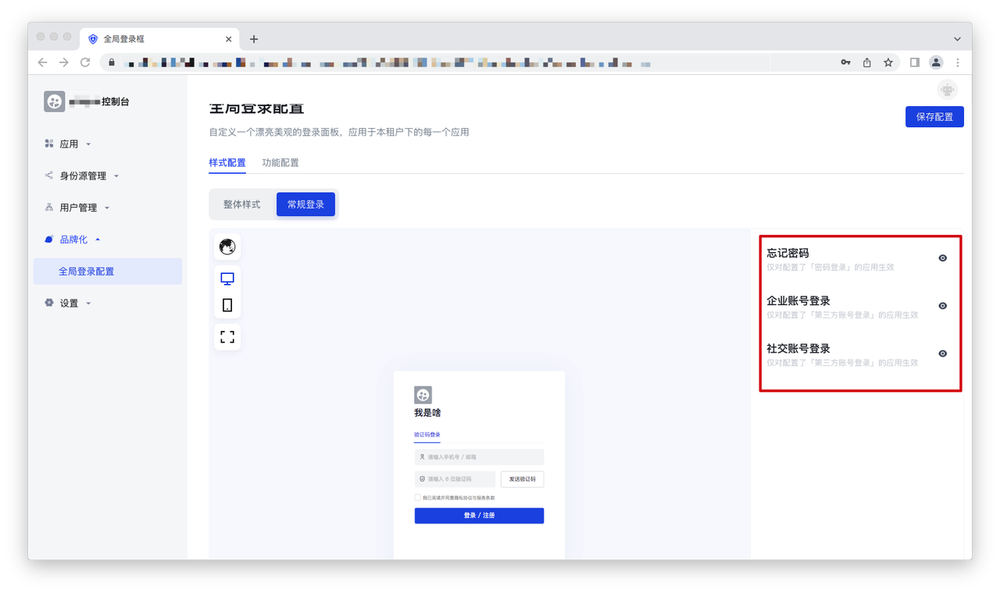

# 品牌化

<LastUpdated/>

## 全局登录配置

**步骤1** 在租户控制台-品牌化-全局登录配置中，可以查看品牌化登录页面：

**步骤2** 预览区域左侧可以分别切换语言/设备类型：

**步骤3** 预览区域右侧是配置区，可以进行品牌化配置，分为「整体样式」和「常规登录」两个 tab。在「整体样式」下：

（1）设置背景

对于网页端应用，可以在「自定义背景」设置登录框背景，在「纯色背景」模式下可以修改背景颜色，在「图片背景」模式下可以上传背景图片，下图以修改纯色背景为例，展示了修改背景颜色后的效果：

（2）设置图标：

可以在「自定义加载图标」的区域设置加载图标，点击「上传图标」，选择本地文件即可设置自定义图标：

（3）设置默认语言：

可在「默认语言」的选择框中选择登录框使用的语言：

（4）设置切换语言：

打开「切换语言」的开关，在登录框会显示切换语言的入口：

（5）自定义CSS

打开「自定义CSS」的开关，在下方代码编辑区域可以修改代码：

**步骤4** 预览区域右侧是配置区，可以进行品牌化配置，分为「整体样式」和「常规登录」两个 tab。在「常规登录」下：

（1）可以配置「忘记密码」是否展示；

（2）可以在「企业账号登录」配置企业身份源是否展示；

（3）可以在「社交账号登录」配置社会化身份源是否展示。

