# 身份源

<LastUpdated/>

## 如何查看关联型/自建型社会化身份源

在租户控制台-社会化身份源管理列表中，可以查看关联型/自建型社会化身份源列表，在「身份源来源」这一列中，「关联」代表该身份源是多租户控制台同步过来的用户池身份源，「自建」代表该身份源是在租户控制台由租户管理员创建的仅属于该租户内部的身份源。

## 如何创建/删除自建型身份源

**步骤1** 在身份源列表上方点击「创建社会化身份源」的按钮：

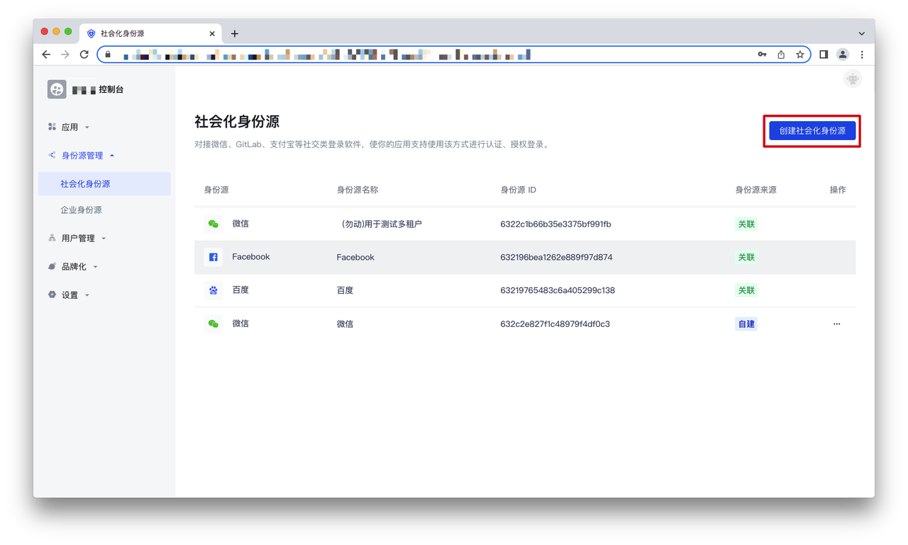

**步骤2** 进入社会化身份源创建页面，选择某个身份源，这里拿微信举例：

选择「微信」，进入微信身份源列表，选择一个身份源:

**步骤3** 配置身份源的基本信息，点击「创建」，即可创建成功。

**步骤4** 在身份源列表中可以查看刚刚创建的身份源，点击右侧的操作按钮，点击「删除」，在弹出的二次确认弹窗中点击「确认」，即可删除成功：

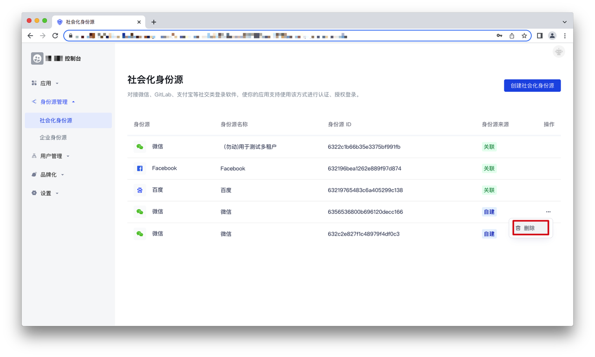

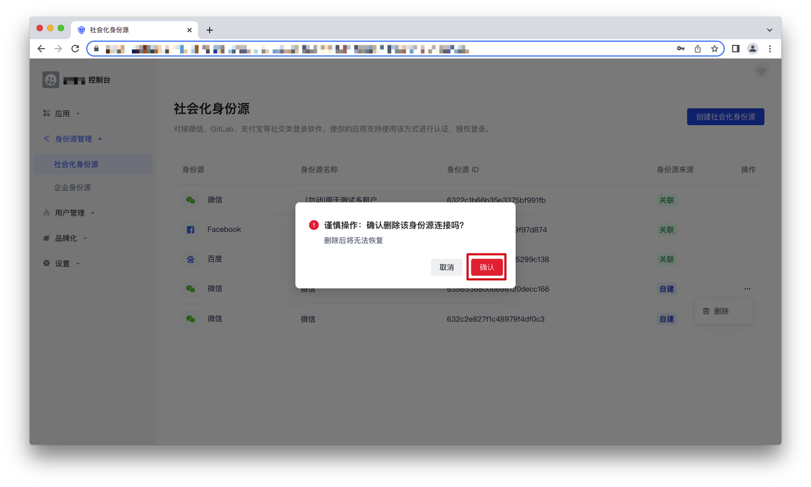

## 如何配置自建型身份源

在社会化身份源的列表中，选择要配置的身份源，点击进入配置页面。

在配置页面可以修改身份源信息，配置使用该身份源的应用，点击「保存」即可修改成功。

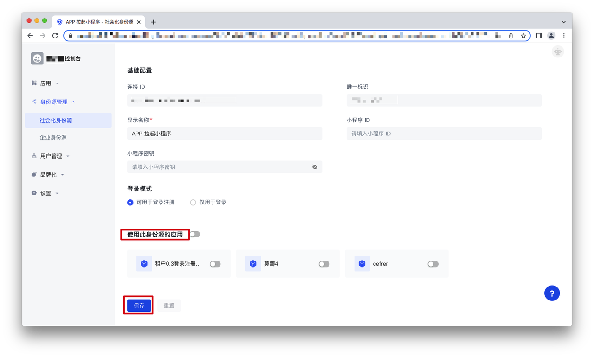

## 如何配置关联型身份源

在身份源列表，点击关联身份源，可以进入身份源配置页面，在该页面可配置使用此身份源的应用，开启开关即可在对应的应用登录时使用此身份源：

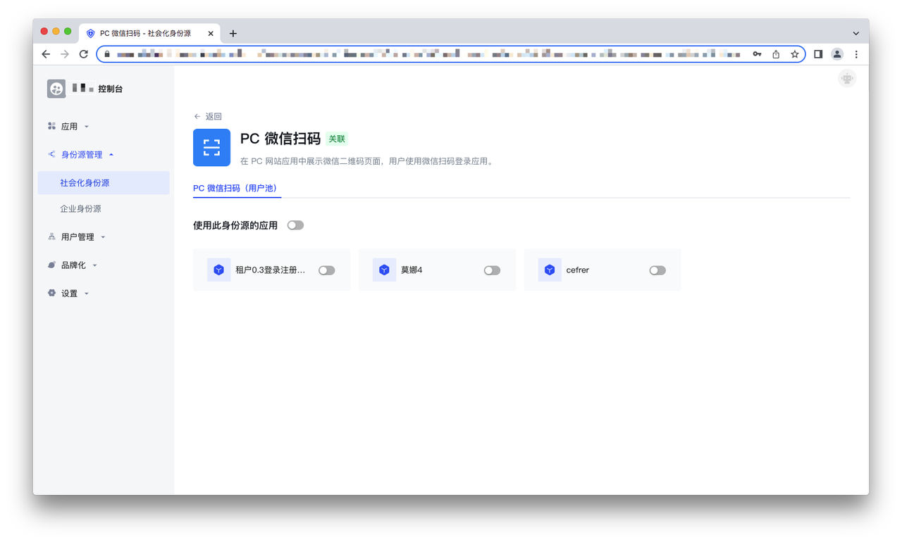

## 如何查看关联/自建型企业身份源

在租户控制台-企业身份源管理列表中，可以查看关联型/自建型企业身份源列表，在「身份源来源」这一列中，「关联」代表该身份源是多租户控制台同步过来的用户池身份源，「自建」代表该身份源是在租户控制台由租户管理员创建的仅属于该租户内部的身份源。

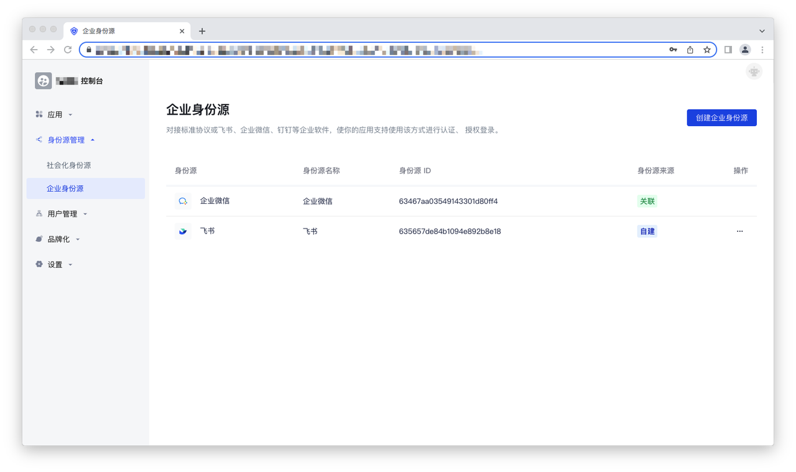

## 如何创建/删除自建型企业身份源

**步骤1** 在身份源列表上方点击「创建企业身份源」的按钮：

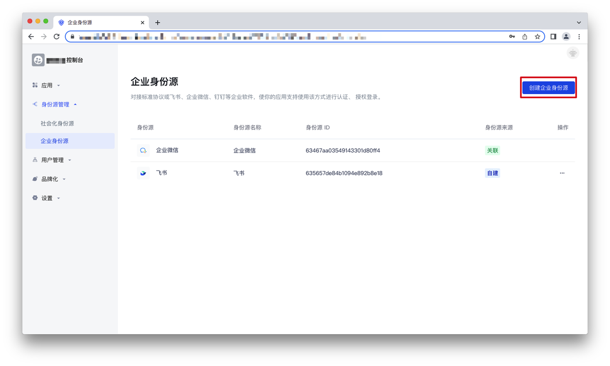

**步骤2** 进入企业身份源创建页面，选择某个身份源：

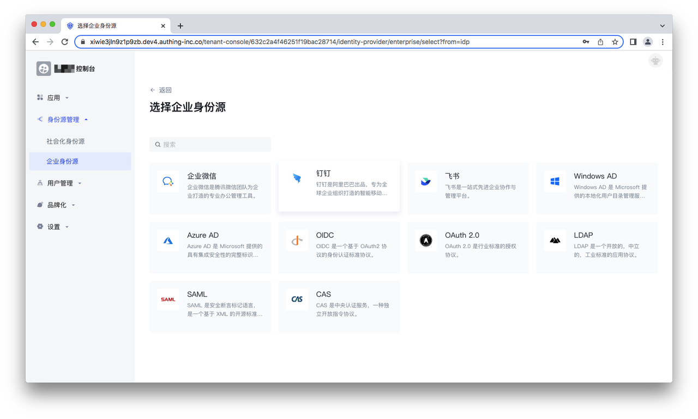

**步骤3** 配置身份源的基本信息，点击「创建」，即可创建成功。

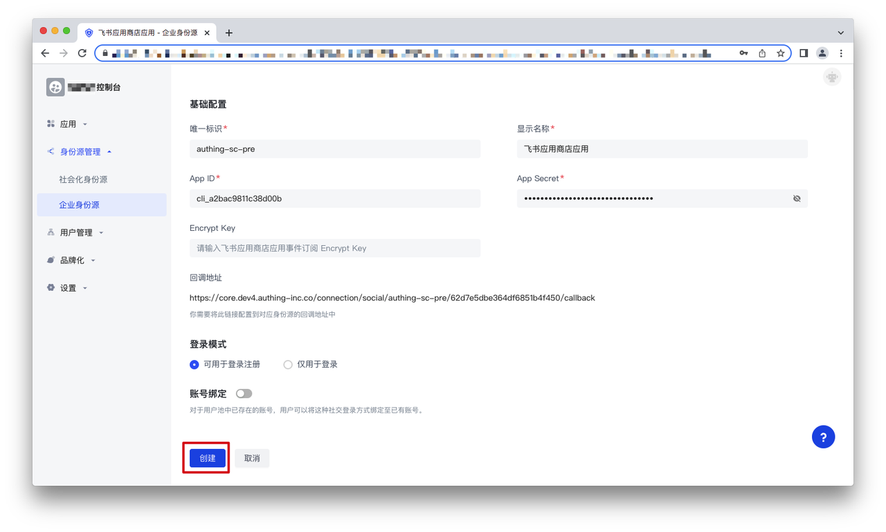

**步骤4** 在身份源列表中可以查看刚刚创建的身份源，点击右侧的操作按钮，点击「删除」，在弹出的二次确认弹窗中点击「确认」，即可删除成功：

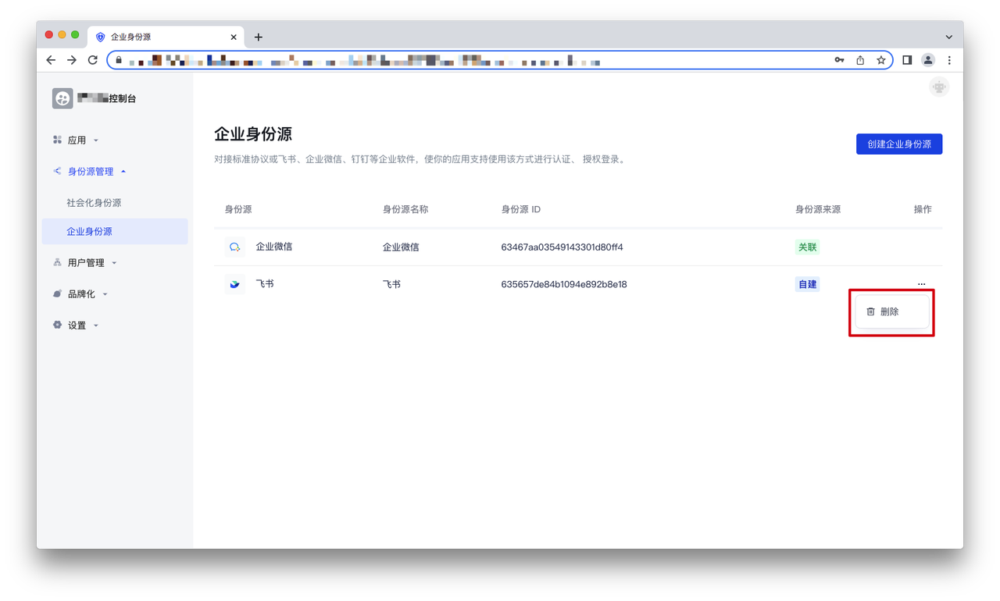

## 如何配置自建型企业身份源

在企业身份源的列表中，选择要配置的身份源，点击进入配置页面。

在配置页面可以修改身份源信息，配置使用该身份源的应用，点击「保存」即可修改成功。

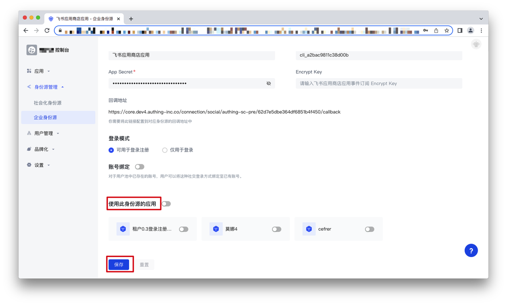

## 如何配置关联型企业身份源

在身份源列表，点击关联身份源，可以进入身份源配置页面，在该页面可配置使用此身份源的应用，开启开关即可在对应的应用登录时使用此身份源：

#[31](./images/31.png)
